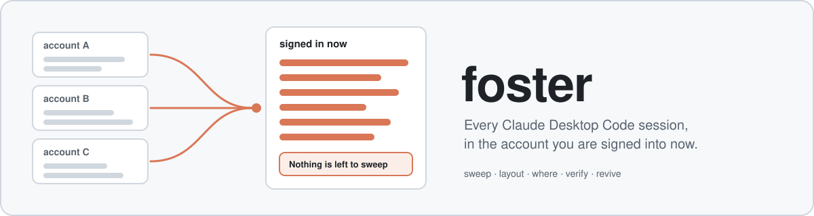
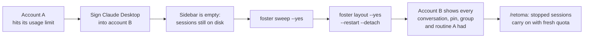
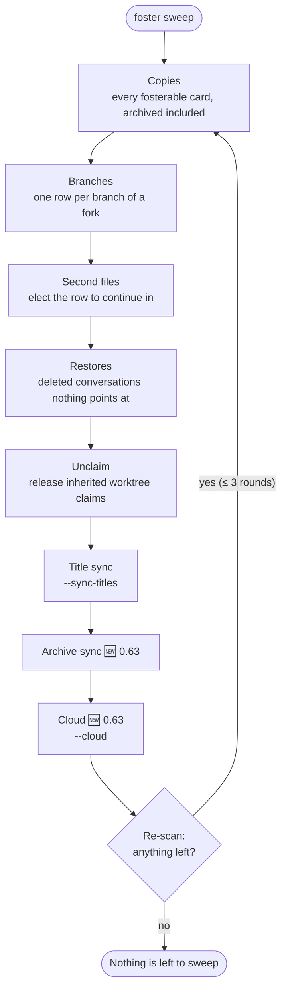
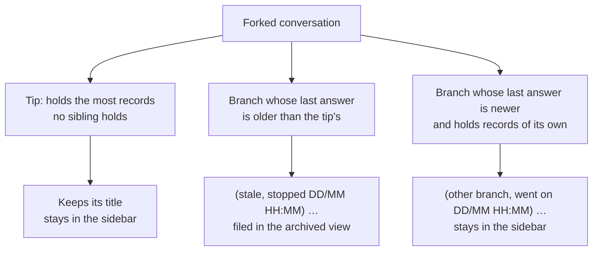
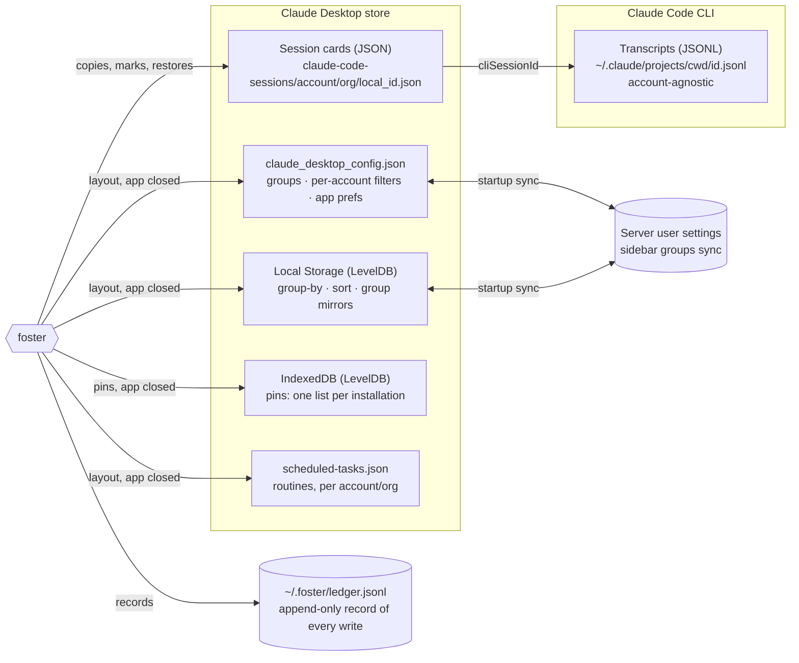
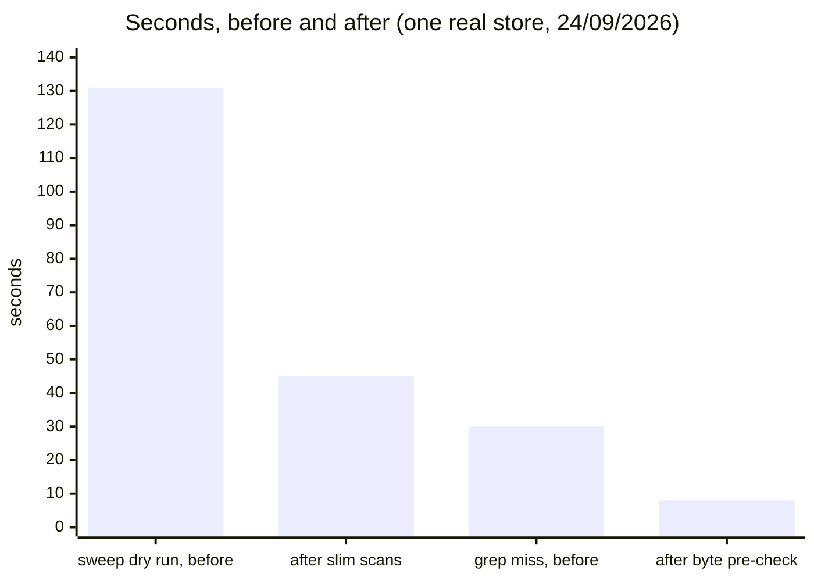
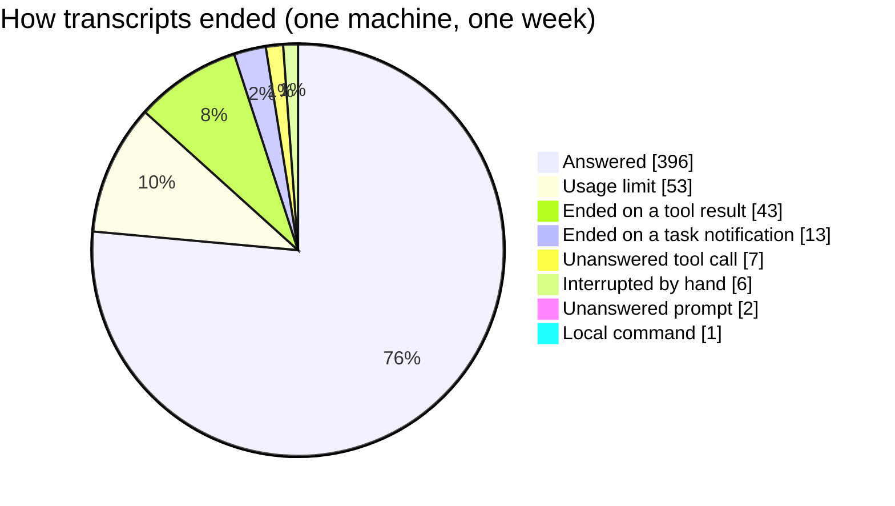

<p align="center">
  
</p>

<h1 align="center">foster</h1>

<p align="center">
  <strong>Switch Claude Desktop accounts without losing a single Code session.</strong><br/>
  One sweep brings every conversation (archived, deleted and forked) into the account signed in now.<br/>
  One layout brings its pins, sidebar groups, routines and settings along.
</p>

<p align="center">
  <a href="https://github.com/cfigueiroa/foster/actions/workflows/ci.yml"></a>
  <a href="https://github.com/cfigueiroa/foster/releases/latest"></a>
  <a href="LICENSE"></a>
  = 20"/>
  
</p>

<p align="center">
  <a href="#-quick-start">Quick start</a> ·
  <a href="#-what-foster-does">Features</a> ·
  <a href="#-commands">Commands</a> ·
  <a href="#-safety-model">Safety</a> ·
  <a href="docs/guide/README.md">Full guide</a>
</p>

> **Status:** early, and Windows-first, since that is where Claude Desktop ships as an MSIX package.
> Every command that writes is a dry run until you pass `--yes`. Read the
> [safety model](docs/guide/safety-model.md) before running anything that writes.

---

## 😩 The problem

Claude Desktop files each Code session under the folder of the **account** you were signed into.
There is no account field inside the session, only the folder. So when one account runs out of
quota and you sign into another, the sidebar goes empty: every conversation you had is still on your
disk, intact, and invisible. The transcripts themselves are account-agnostic; only a pointer has to
move. [How it works →](docs/guide/how-it-works.md)

## ✨ What foster does

<table>
  <tr>
    <td width="33%" valign="top">
      <h3>🧹 One sweep, everything</h3>
      <code>foster sweep</code> copies every session from every other account, <b>archived included</b>,
      and brings back conversations the app deleted that nothing points at. It re-scans until it can
      say <i>“Nothing is left to sweep”</i>.
    </td>
    <td width="33%" valign="top">
      <h3>🌿 One row per branch</h3>
      A conversation continued in two accounts is a fork. Each branch gets its own row; the tip keeps
      the clean title, a branch that stopped is marked and filed away, a branch that went on stays.
    </td>
    <td width="33%" valign="top">
      <h3>📄 Two files, one conversation</h3>
      Continuing from a repository and from its worktree leaves two transcripts under one id. foster
      measures what each row can reach and elects the one to continue in.
    </td>
  </tr>
  <tr>
    <td valign="top">
      <h3>🏷️ Titles and archive stay in step</h3>
      <code>--sync-titles</code> carries a rename across; a name a person chose beats one the app
      generated. 🆕 <i>0.63:</i> the archived flag follows the account used last.
    </td>
    <td valign="top">
      <h3>📌 Layout parity</h3>
      <code>foster layout</code> brings sidebar groups, routines and the filter menu.
      🆕 <i>0.63:</i> pins, group moves and account-keyed app settings too.
    </td>
    <td valign="top">
      <h3>☁️ Cloud sessions, locally</h3>
      <code>foster cloud pull</code> turns a code.claude.com session into a local transcript and a
      sidebar card. 🆕 <i>0.63:</i> <code>sweep --cloud</code> brings every other account's.
    </td>
  </tr>
  <tr>
    <td valign="top">
      <h3>🔁 Pick up where it stopped</h3>
      <code>foster revive</code> lists sessions a usage limit stopped; <code>/retoma</code> tells each
      to carry on. 🆕 <i>0.63:</i> also turns a restart cut off mid-way.
    </td>
    <td valign="top">
      <h3>🔎 Audits you can trust</h3>
      <code>where</code> names the row to open, <code>verify</code> checks a restart undid nothing,
      <code>sweep --prove</code> re-reads every file independently of the sweep's own bookkeeping.
    </td>
    <td valign="top">
      <h3>📊 Reports</h3>
      <code>grep</code> every transcript by what was said, <code>export</code> one to Markdown/HTML,
      <code>disk</code> for bytes per account, <code>stats</code> for tokens and limit stops.
    </td>
  </tr>
  <tr>
    <td valign="top">
      <h3>🔄 Restart from inside the app</h3>
      The app reads its sessions once, at start. <code>--detach</code> restarts it from a process
      outside its tree, so even a session the app hosts can finish the job.
    </td>
    <td valign="top">
      <h3>🛡️ Reversible by design</h3>
      Originals are never touched; copies get a fresh id. Every write lands in an append-only ledger,
      and <code>foster return</code> removes what foster added.
    </td>
    <td valign="top">
      <h3>👥 Accounts and clients</h3>
      Who is signed in where, which plan, live 5-hour and weekly limits, renewals, and CLI clients
      opened as any account in their own terminal tab.
    </td>
  </tr>
</table>

> 🆕 marks what is new in **0.63.0** (PRs
> [#159](https://github.com/cfigueiroa/foster/pull/159) to [#163](https://github.com/cfigueiroa/foster/pull/163)).

## 🔀 The account switch, end to end



## ⚡ Quick start

**1. Install** (PowerShell). The installer pins the release it came from and verifies the bundle's
SHA256 before running anything:

```powershell
irm https://github.com/cfigueiroa/foster/releases/latest/download/install.ps1 | iex
```

Pass `-NoLaunch` to skip opening the guided menu at the end. To pin a version, fetch
`https://raw.githubusercontent.com/cfigueiroa/foster/v<version>/install.ps1` instead.

**2. Check the machine:** which store, which account, whether the app is running:

```bash
foster doctor
```

**3. Sweep.** Without `--yes` nothing is written; read the plan first:

```bash
foster sweep          # what it would do
foster sweep --yes    # do it
```

**4. Bring the layout and restart.** The app only sees new sessions after it starts again, and
groups, pins and routines can only be written while it is closed:

```bash
foster layout --yes --restart --detach
```

Run with no arguments (`foster`) for a guided menu that stays open. Details:
[the whole sweep](docs/guide/sweep-and-forks.md) ·
[why a restart is needed](docs/guide/restart-and-detach.md) ·
[long-form usage](docs/guide/usage.md).

## 🧬 Inside the sweep

Each pass works from one scan and one walk of the transcript tree, and the run repeats (up to three
rounds in one process) until a re-plan finds nothing left.



The sweep also counts what can **never** come (scheduled tasks, sessions never opened, files over the
10 MB the app refuses to load), so a gap is named rather than hidden.

### 🌿 Forks: which row to open

A fork is one conversation continued in more than one account, each continuation on a transcript of
its own. The sweep does not choose between them; it labels them.



"Went on" is judged on the last **answer**, never the last record: opening a stale row appends a
click, not work. The words are yours: `--stale-prefix`, `--branch-prefix`, `--other-file-prefix`.
More in [sweep & forks](docs/guide/sweep-and-forks.md) and
[one conversation, two files](docs/guide/two-file-conversations.md).

## 🗺️ Where each piece of state lives

Nothing in Claude Desktop keeps "a session" in one place. foster reads all of these, and writes each
only the way, and at the moment, it is safe to.



Why the app has to be closed for some of these, and how groups survive the server's startup sync:
[pins, groups, routines and the filter menu](docs/guide/layout-pins-groups-settings.md).

## 📈 Measured, not assumed

Every number in this repository comes from a real store (one machine, one set of accounts) and is
stated with the date it was measured in [AGENTS.md](AGENTS.md). A few of the performance ones:



<sub>Sweep dry run with the <code>/fosteia</code> flags on a store of 25,174 cards; <code>foster grep</code> for an absent term over
11,202 transcripts (13.6 GB), after-figure 7 to 9 s.</sub>

And why `revive` learned to look past usage limits: how the last turn of every transcript ended, over
one week on the same machine (570 files):



## 🧭 Commands

`foster --help` files every command under these same headings. Every write command is a dry run
without `--yes`; most take `--json`.

<details open>
<summary><b>Start here</b></summary>

| Command                     | What it does                                                    |
| --------------------------- | --------------------------------------------------------------- |
| `foster`                    | Guided menu: tick sources, choose sessions, review, confirm     |
| `foster doctor`             | Environment check: store location, app state, process table     |
| `foster stores`             | Installations foster knows about, and what to pass to `--store` |
| `foster clients`            | The CLI's config directories, and who is signed into each       |
| `foster clients --fragment` | A Windows Terminal fragment (JSON), one profile per client      |

</details>

<details open>
<summary><b>Bringing conversations in</b></summary>

| Command                             | What it does                                                                      |
| ----------------------------------- | --------------------------------------------------------------------------------- |
| `foster sweep`                      | The whole job: every account, archived and deleted included                       |
| `foster sweep --sync-titles`        | Also re-title copies whose original has been renamed since                        |
| `foster sweep --dates`              | Advance a card's date to its transcript's last answer                             |
| `foster sweep --prove`              | Independently check every conversation is fully reachable (exit 1 on a gap)       |
| `foster sweep --undo-retitles`      | Put every marked card back to the title and archived flag it had                  |
| `foster sweep --cloud` 🆕           | Also pull every other signed-in account's cloud sessions (`--cloud-archived` too) |
| `foster sweep --no-archive-sync` 🆕 | Leave archived flags alone (on by default: they follow the account used last)     |
| `foster scan`                       | Read-only inventory of accounts, organizations and sessions                       |
| `foster list`                       | Sessions from other accounts that are available to foster                         |
| `foster foster`                     | Create the copies, one selection at a time                                        |
| `foster restore`                    | Bring back sessions deleted in the app                                            |
| `foster import-codex`               | Bring Codex CLI threads in as Claude conversations                                |

</details>

<details open>
<summary><b>After the sweep</b></summary>

| Command                                    | What it does                                                                          |
| ------------------------------------------ | ------------------------------------------------------------------------------------- |
| `foster layout --yes --restart [--detach]` | Groups, routines, pins, filter menu and app settings, written while the app is closed |
| `foster view` / `view set` / `view copy`   | Show or change the sidebar's filter menu                                              |
| `foster where <query>`                     | Every account holding a card for one conversation, and which row to continue in       |
| `foster verify`                            | After a restart, check nothing foster wrote was undone                                |
| `foster return`                            | Remove fostered copies, restoring the previous state                                  |
| `foster consolidate`                       | One row per piece of work, on the branch that carried on                              |
| `foster unclaim`                           | Release the worktree claim a copy inherited from its original                         |
| `foster dates`                             | Advance card dates to their transcript's last answer                                  |
| `foster status`                            | What is currently fostered                                                            |
| `foster pin`                               | Pin sessions in the sidebar, or see what is pinned                                    |
| `foster cache clear`                       | Delete the persistent scan cache (safe; it rebuilds)                                  |
| `foster purge`                             | ⚠️ Destroy the conversations behind deleted sessions, no undo                         |

</details>

<details>
<summary><b>Accounts</b></summary>

| Command                   | What it does                                                       |
| ------------------------- | ------------------------------------------------------------------ |
| `foster accounts`         | Every account here: who, which plan, whether it is still paid for  |
| `foster whoami`           | The signed-in account's name, email and plan, from the app's cache |
| `foster identify`         | Name an account by asking the API with a credential already here   |
| `foster label` / `labels` | Give an account a human name; list the name each goes by           |
| `foster usage`            | Live 5-hour and weekly limits of the signed-in account             |
| `foster renewals`         | Usage resets and billing dates across every account                |

</details>

<details>
<summary><b>Credentials and clients</b></summary>

| Command                                      | What it does                                                       |
| -------------------------------------------- | ------------------------------------------------------------------ |
| `foster switch`                              | Sign a CLI config directory in as another account, no logout       |
| `foster vault`                               | The credentials foster is holding, and whose they are              |
| `foster guard`                               | Record who is signed into a client, so the vault can put them back |
| `foster point <link>`                        | Repoint a directory link at another client                         |
| `foster client new\|register\|forget`        | Seed a working client; remember or withdraw a directory            |
| `foster client open <client>`                | A Windows Terminal tab signed in as one client                     |
| `foster profile new\|register\|forget\|list` | Name a Desktop profile (a second userData root) for `--store`      |

</details>

<details>
<summary><b>Live sessions</b></summary>

| Command                       | What it does                                                      |
| ----------------------------- | ----------------------------------------------------------------- |
| `foster live`                 | Conversations a claude process holds open (`--stop`, `--prune`)   |
| `foster revive`               | Sessions a usage limit stopped: the work list for `/retoma`       |
| `foster rescue`               | Conversations stranded by a crash (`--open` for a tab each)       |
| `foster unstarted`            | Background-task requests whose session died before answering once |
| `foster detached --last`      | What the last `--detach` run did, read after the app comes back   |
| `foster transcript <id>`      | Read a conversation's transcript                                  |
| `foster resume <id> <prompt>` | Send one prompt to an existing conversation, headlessly           |
| `foster grep <regex>`         | Search every transcript by what was actually said                 |
| `foster export <id>`          | Render one conversation to Markdown, HTML or JSONL                |

</details>

<details>
<summary><b>Reports, cloud and the app</b></summary>

| Command                                     | What it does                                                  |
| ------------------------------------------- | ------------------------------------------------------------- |
| `foster disk`                               | Bytes per account and per project, for cards and transcripts  |
| `foster stats`                              | Token usage, sessions and usage-limit stops                   |
| `foster cloud list`                         | Every cloud session (code.claude.com) a signed-in CLI can see |
| `foster cloud pull <id> --into <cwd> --yes` | A local transcript and sidebar card from one cloud session    |
| `foster app status\|quit\|start\|restart`   | Drive Claude Desktop itself                                   |
| `foster app pref` / `app link`              | Read or change the app's settings; hand it a `claude://` link |
| `foster app login`                          | Sign a second profile in through the browser (a human's job)  |
| `foster agent "<task>"`                     | A Claude agent with foster's operations as its tools          |

</details>

Global options: `--store <path|name>`, `--ledger <path>`, `--no-cache`. Full reference, with the
reasoning behind each command: [usage](docs/guide/usage.md) ·
[accounts & clients](docs/guide/accounts-and-clients.md) ·
[revive & rescue](docs/guide/revive-and-rescue.md) · [reports](docs/guide/reports.md) ·
[cloud sessions](docs/guide/cloud-sessions.md) · [the agent](docs/guide/agent.md).

## 🔒 Safety model

- **Originals are never modified.** Fostering only adds a file, with a fresh session id the server has
  never seen; deleting a copy can never reach the original.
- **Dry run by default.** Nothing is written without `--yes`.
- **Everything is recorded.** Each finished write is appended to `~/.foster/ledger.jsonl`, and the
  ledger (not the titles, not a marker the app may drop) decides what `return`, `sync-titles` and
  `verify` do.
- **Adding is safe while the app runs; removing is not.** `return` refuses a copy the running app has
  already loaded, and offers to close the app first.
- **One command destroys data:** `purge`. `--yes` alone will not run it, and the agent cannot reach it.
- **Credentials are copied, never minted or refreshed**, never logged, printed or put on a command
  line.

The whole model, including the one registry value `app login` touches and what is not supported:
[safety model](docs/guide/safety-model.md).

## 🤖 Claude Desktop slash commands

This repository ships two commands for a Claude Code session running inside Claude Desktop
([`.claude/commands`](.claude/commands)):

| Command    | What it does                                                                                                                                                                                       |
| ---------- | -------------------------------------------------------------------------------------------------------------------------------------------------------------------------------------------------- |
| `/fosteia` | The whole switch in one go: checks the installed foster is current, runs `foster sweep --yes --sync-titles --restart` with the three marks in Portuguese, then a detached `foster layout` restart. |
| `/retoma`  | The step after. Reads `foster revive --json` and sends each session a usage limit stopped, or a restart cut off, one message through the app's own session tools: carry on, highest return first.  |

Neither asks for confirmation: every copy is undone by `foster return`, and running the command is
the decision.

## 🛠️ Development

```bash
npm ci
npm run dev -- doctor   # run from source
npm run check           # typecheck, lint, format, privacy guard, coverage floor
npm run build           # single-file bundle in dist/
```

Tests run against synthetic stores in a temporary directory and never touch a real installation.
The repository is public, so `npm run privacy` rejects any Windows user-profile path or realistic
account uuid anywhere `git add -A` would pick up; fixture uuids look like
`00000000-0000-4000-8000-00000000000a`. CI, the coverage floor and releasing:
[development](docs/guide/development.md). Notes for agents working here: [AGENTS.md](AGENTS.md).

## ❓ FAQ

<details>
<summary><b>Why does the app need a restart before the copies show up?</b></summary>

Claude Desktop reads its session directory once, while it initialises, and keeps what it found in
memory. Nothing watches the directory afterwards, and reloading the window (F5) redraws from memory,
not from disk. `--restart` does it for you; from a session the app itself hosts, add `--detach` so the
restart runs from a process outside the app's tree.
[More →](docs/guide/restart-and-detach.md)

</details>

<details>
<summary><b>Why aren't copies marked in their title?</b></summary>

They used to be (`↪ <title>`). On a swept store 704 of 764 rows were copies, so the mark was on 92%
of the sidebar and separated nothing. It was also unreliable: the title belongs to the app, which
drops or inherits it. foster's own list draws its arrow from the ledger, which cannot be wrong;
`--prefix` still exists if you want the old behaviour.
[More →](docs/guide/how-it-works.md#why-a-copy-is-not-marked-in-its-own-title)

</details>

<details>
<summary><b>Can I undo a sweep?</b></summary>

Yes. `foster return` deletes the copies foster wrote (scope it with `--to <accountUuid>`, `--title`,
`--session`); the originals were never touched, so the sidebar is simply as it was.
`foster sweep --undo-retitles` puts every marked card back to the title and archived flag it had.
The one thing with no undo is `purge`, which no sweep ever runs.

</details>

<details>
<summary><b>Does foster touch my login or my tokens?</b></summary>

Only where a command says so. `usage` and `identify` read a token in memory and send it on read-only
`GET`s to `api.anthropic.com`, then drop it. `switch` and `guard` copy the CLI's credential file
byte for byte into a local vault. foster never mints, refreshes or removes a credential, never signs
anyone in, and never logs, prints or puts a token on a command line.
[More →](docs/guide/safety-model.md)

</details>

<details>
<summary><b>Can I switch the Desktop app's account without signing out?</b></summary>

Not by editing anything on disk: the app keeps its account in memory, and no file, flag or deep link
selects one. A second Desktop profile is a second account beside the first (`foster profile`,
`foster app login`). What foster does instead is make the account you switch to look like the one you
left, and switch **CLI** clients between accounts, where the account really is a file.
[More →](docs/guide/accounts-and-clients.md#what-about-switching-accounts)

</details>

## 📚 Documentation

| Guide                                                                        | Covers                                               |
| ---------------------------------------------------------------------------- | ---------------------------------------------------- |
| [How foster works](docs/guide/how-it-works.md)                               | Why sessions disappear, what a copy is               |
| [The sweep, forks and worktree claims](docs/guide/sweep-and-forks.md)        | Every pass of `foster sweep`, fork marks, title sync |
| [One conversation, two files](docs/guide/two-file-conversations.md)          | Repository/worktree splits, `where`, `--prove`       |
| [Deleted conversations](docs/guide/deleted-conversations.md)                 | `restore` and `purge`                                |
| [Revive and rescue](docs/guide/revive-and-rescue.md)                         | Usage-limit stops, crash-stranded cards              |
| [Restart and `--detach`](docs/guide/restart-and-detach.md)                   | Why a restart, and how to do it from inside the app  |
| [Pins, groups, routines, filters](docs/guide/layout-pins-groups-settings.md) | `layout`, `pin`, `view`, `verify`                    |
| [Accounts, clients and switching](docs/guide/accounts-and-clients.md)        | Multiple CLI clients, switching a client's account   |
| [Reports](docs/guide/reports.md)                                             | `disk` and `stats`                                   |
| [Cloud sessions](docs/guide/cloud-sessions.md)                               | `cloud list` and `cloud pull`                        |
| [Usage (long form)](docs/guide/usage.md)                                     | Install, the menu, naming accounts, scheduled tasks  |
| [The agent](docs/guide/agent.md)                                             | `foster agent` and the app's own session tools       |
| [Safety model](docs/guide/safety-model.md)                                   | What foster writes, where, and what it never does    |
| [Development](docs/guide/development.md)                                     | Tests, CI, coverage floor, releasing                 |

## 📄 License

MIT, see [LICENSE](LICENSE).
